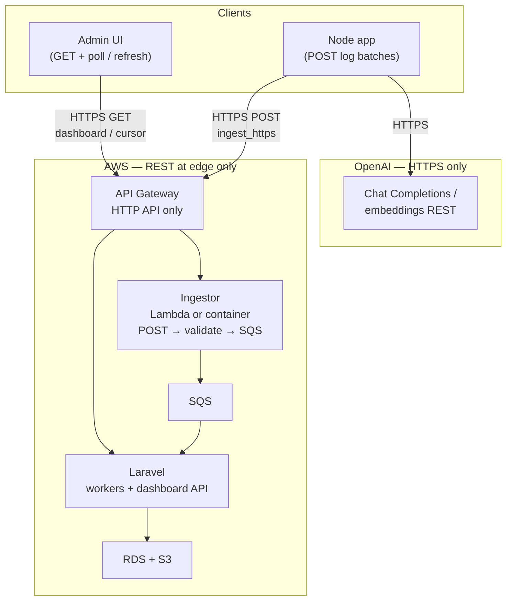
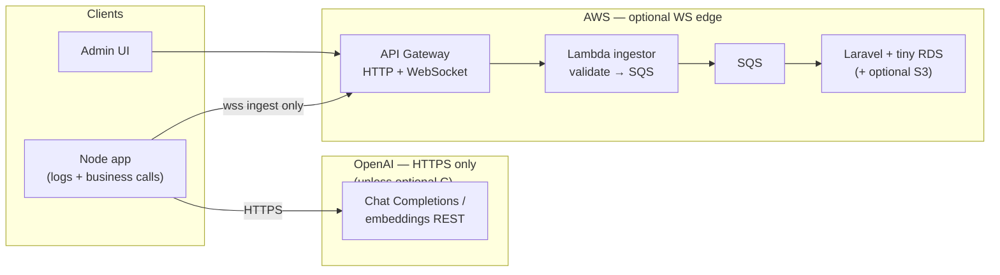
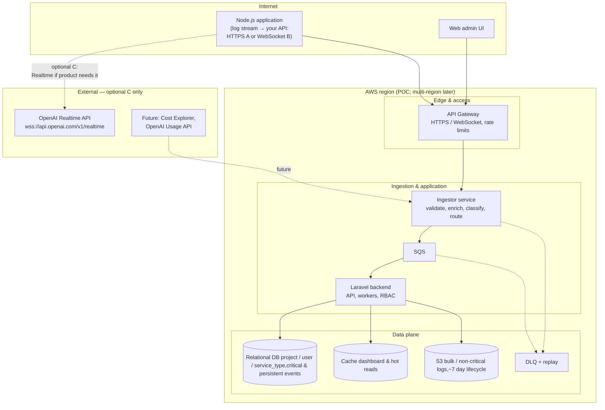

# System Design:  Project Management Tool Logging System

A system that I can use to monitor errors and manage the costs of projects and monitor the separate systems that I create that utilise OpenAi and AWS. 

### Functional requirements

| ID | Requirement | A | B | C |
| --- | --- | --- | --- | --- |
| F1 | Ingest observability events from the app to **your** API (default **HTTPS** `ingest_https`) | Yes | Yes | Yes |
| F2 | Optional **WebSocket** ingest / live stream to **your** API (`ingest_websocket`) | No (HTTPS only) | Yes | No (**C** is OpenAI Realtime, not your ingest WS; combine **A+B** or **B+C** if you need both) |
| F3 | Super-admin UI: dashboard **per project** with persistent / critical internal messages | Yes | Yes | Yes |
| F4 | Log identity: **per project**, **per user**, **per service type** (e.g. counsellor, dentist) | Yes | Yes | Yes |
| F5 | Capture **text-to-voice** request counts and **onboarding correction** counts | Yes | Yes | Yes |
| F6 | **Toggle logging** on/off per project or customer at **ingestor** | Yes | Yes | Yes |
| F7 | Supplemental metrics: overtyped fields, **latency**, **token usage**, recommendation / appointment outcomes | Yes | Yes | Yes |
| F8 | Integrate **AWS Cost Explorer** (later) for infra cost visibility | Yes | Yes | Yes |
| F9 | Integrate **OpenAI Usage API** (later) for API spend visibility | Yes | Yes | Yes |
| F10 | Optional **OpenAI Realtime** sessions for voice / low-latency product flows | No (REST only to OpenAI) | No (unless you add **C**) | Yes |

### Non-functional requirements

| ID | Requirement | A | B | C |
| --- | --- | --- | --- | --- |
| NF1 | **Scalability:** design for more projects, customers, and users; POC starts small | Yes | Yes | Yes |
| NF2 | **Horizontal scaling** path as load grows | Yes | Yes | Yes |
| NF3 | **Regional** placement: customer data in region (start single region) | Yes | Yes | Yes |
| NF4 | **API Gateway rate limiting** to limit abuse | Yes | Yes | Yes |
| NF5 | **Latency** acceptable for OpenAI and cross-component calls | Yes | Yes | Yes |
| NF6 | **Cache** for dashboard / hot reads where useful | Yes | Yes | Yes |
| NF7 | **DLQ** + replay story for failed ingest / processing | Yes | Yes | Yes |
| NF8 | **TLS (HTTPS / WSS)** for client ↔ your API | Yes | Yes | Yes |
| NF9 | **RBAC:** least-privilege admin; super-admin role | Yes | Yes | Yes |
| NF10 | **Logging hygiene:** `x-request-id` (or equivalent); **no** confidential prompt bodies in logs | Yes | Yes | Yes |
| NF11 | **Sensitive / token data** handled and stored per security policy | Yes | Yes | Yes |
| NF12 | **Authentication and authorization** on admin and ingest paths | Yes | Yes | Yes |
| NF13 | **Live dashboard updates** without aggressive polling (server push) | Partial (polling / refresh) | Yes | Partial (**C** does not push your dashboard; use **B** for that) |

### Constraints

| ID | Constraint | A | B | C |
| --- | --- | --- | --- | --- |
| C1 | Respect **OpenAI API limits** (rate / quota) for product calls | Yes | Yes | Yes |
| C2 | **AWS POC:** low cost, **single region**, design must **scale out** later | Yes | Yes | Yes |
| C3 | Use a **message broker** — **Amazon SQS** (room to expand) | Yes | Yes | Yes |
| C4 | **Laravel** for application persistence and APIs | Yes | Yes | Yes |
| C5 | **Critical / persistent** events → **relational DB** | Yes | Yes | Yes |
| C6 | **Non-critical / bulk** logs → **S3** with ~**7-day** retention | Yes | Yes | Yes |
| C7 | Observability **does not require** OpenAI Realtime; Realtime is **product-optional** | Satisfied | Satisfied | **C** is additive only |


## Architecture options
| | **A. Original / HTTPS-only** | **B. Optional — WebSocket ingest** | **C. Optional — OpenAI Realtime API** |
| --- | --- | --- | --- |
| **Role** | Default transport: `POST` logs, `GET` dashboard + polling | Add `wss://` **to your API** only (`ingest_websocket`) when you want server push | Add **OpenAI** `wss://api.openai.com/v1/realtime` for voice / Realtime sessions |
| **OpenAI (product app)** | **HTTPS** `chat.completions` / embeddings only; **no** Realtime unless you also adopt **C** | Same — **no** OpenAI Realtime unless you also adopt **C** | **Realtime** token/session charges on **[OpenAI Usage](https://platform.openai.com/usage)** |
| **AWS edge** | **API Gateway HTTP API** (REST) only; no WebSocket route | **HTTP + WebSocket** API routes to your ingestor | **C** does not replace your edge — still **A** or **B** for **your** observability API |
| **Trade-off** | Simplest ops; polling may mean many `GET`s if refresh is aggressive | Live updates; WebSocket connection + message billing | **Extra** OpenAI cost; keep `ingest_ws` vs `openai_realtime_ws` separate in code |
| **Est. AWS baseline / month (USD, POC)** — single region, small RDS + Laravel + SQS + API Gateway + Lambda/small compute, **logging mostly off**, **no NAT Gateway** | **~$35–110** (lowest edge complexity) | **~$40–120** (WebSocket API + messages / connection-minutes on top of **A**-shaped stack) | Same AWS bill as **A** or **B** (pick ingest); **C** does not add its own AWS tier |
| **Est. AWS + variable** — logging **on** or high traffic | Gateway, SQS, workers, S3, DB writes, CloudWatch scale with volume | Same + long-lived **WS** to your API can dominate if many connections | Same as **A** or **B**; Realtime traffic is billed by **OpenAI**, not this row |
| **OpenAI spend (beyond AWS)** | Chat Completions / embeddings: **usage** ($ per token) via [pricing](https://openai.com/pricing) | Same | **+** Realtime **sessions + tokens** (usage-priced); can exceed REST chat if voice sessions are long |
| **Cost footnotes** | Add **~$32+/mo + data** if you need **NAT Gateway**; add **ElastiCache** if you add Redis. Use the [AWS Pricing Calculator](https://calculator.aws/) for SKU-level numbers. | Same footnotes as **A**. | **C** adds **OpenAI Realtime** usage only — no separate “Realtime AWS tier.” **$0** Realtime until you open `wss://api.openai.com/v1/realtime`. |


### A. Original: HTTPS-only ingest (default)

- **No `wss://` to your API** — ingest uses **`POST /ingest/...`** (single events or JSON batches); use **`Authorization`** / API keys like any REST service.
- **Admin dashboard** — **`GET /api/projects/.../events`** (or similar) with **`If-None-Match`** / cursor / `since=` query params; the UI **polls** on an interval or refreshes on demand. Add **B** when you want server push without polling.
- **OpenAI (counselling app)** — **`HTTPS`** `chat.completions` / embeddings only unless you add **C**.
- **Edge** — **API Gateway HTTP API** (REST) only; no WebSocket route to provision or monitor.



**Schema note for A:** use a non-Realtime model id in payloads (e.g. `gpt-4o-mini`) unless the event truly came from a Realtime session (**C**). Tag transport as `ingest_https` in metrics.


### B. Optional: WebSocket ingest to your API (`ingest_websocket`)

- **Browser / Node → `wss://` your API only** for live logs and dashboard fan-out. **Never** confuse this with **`wss://api.openai.com/v1/realtime`** — that is **C** (OpenAI).
- **Counselling (or other) app → OpenAI:** `POST /v1/chat/completions` (or embeddings) over **HTTPS** from your backend unless you adopt **C** for voice.
- **AWS:** e.g. **HTTP + WebSocket API Gateway**, **Lambda** ingestor → **SQS** → **Laravel** + small **RDS**; **one** region for POC; **ElastiCache** optional.
- **Security:** `wss://` to your host, auth on connect, TLS everywhere.



**Schema note for B:** same as **A** for model ids; tag transport as `ingest_websocket`.


### C. Optional: OpenAI Realtime API (voice / low-latency)

Use **only** when the product needs a **Realtime** session to OpenAI. Observability ingest stays **A** or **B**; this is a **separate** WebSocket to **OpenAI’s** endpoint.

- **Connection:** `wss://api.openai.com/v1/realtime?model=...` with `Authorization: Bearer <OPENAI_API_KEY>` (typically **server-side**).
- **Billing:** Realtime **sessions and tokens** — **[OpenAI Usage](https://platform.openai.com/usage)** — not AWS ingest traffic.
- **Name it** `openai.realtime` / `openai_realtime_ws` in code so it never mixes with `ingest_websocket`.



The AWS half of this diagram is the **same backend** as **A** or **B**; **C** adds only the **optional** dotted line to OpenAI Realtime when you enable that product path.

---


Schema

```
{
  "schema_version": "1.0",
  "event_id": "550e8400-e29b-41d4-a716-446655440000",
  "event_type": "observability.log.v1",
  "severity": "info",
  "occurred_at": "2026-04-08T12:34:56.789Z",
  "project_id": "proj_123",
  "user_id": "usr_456",
  "service_type": "counsellor",
  "request_id": "req-abc-789",
  "tokens_used": 142,
  "latency_ms": 380,
  "has_correction": false,
  "has_recommended": false,
  "has_appointment": false,
  "provider": "openai",
  "model": "gpt-4o-realtime-preview"
}
```


## Load Balancing

If user count and usage per project grow enough that **latency rises** (queues backing up, hot API paths saturating, or DB contention), add **horizontal capacity** and **spread traffic** at the layers that become bottlenecks.

- **API Gateway** already scales the edge; 
- in front of **multiple ingestor instances** 
- in front of **multiple Laravel web/API instances** 
- **Per region**: deploy **replicas in the region where the customer’s data lives** so work stays local; cross-region calls stay the exception. If one region’s projects spike, scale that region’s ingestor/Laravel pools and **SQS consumer count** independently.
- **SQS workers**: scale **more consumers** on the same queues rather than adding a classic load balancer; the queue coordinates work across instances.
- **Data layer**: rising latency from the database is addressed with **read scaling** (replicas, cached dashboard reads), **RDS Proxy** or connection pooling, and **sharding or partitioning by tenant/region** before expecting a load balancer to fix DB-bound latency.


# Running this application locally

The Laravel app lives in `backend/`. Docker Compose at the **repository root** (`logging_system/`) runs MySQL, Redis, PHP-FPM, and Nginx together.

## Docker (recommended)

**Prerequisites:** [Docker Desktop](https://www.docker.com/products/docker-desktop/) (or Docker Engine + Compose plugin).

From the **parent directory** of `backend` (the folder that contains `docker-compose.yml`):

```bash
cd /path/to/logging_system
docker compose up --build
```

- **Web app:** [http://localhost:8080](http://localhost:8080)
- **Health check:** [http://localhost:8080/up](http://localhost:8080/up)
- **Observability ingest (this API):** `POST` [http://localhost:8080/api/v1/ingest](http://localhost:8080/api/v1/ingest)

The `app` container runs `composer install` if `vendor/` is missing and applies migrations on startup. Database and Redis settings are injected by Compose (see `docker-compose.yml`); your `backend/.env` **APP_KEY** is still read from disk, so keep a valid key there.

**Ports exposed:** `8080` (HTTP), `3306` (MySQL), `6379` (Redis). Stop the stack with `Ctrl+C` or `docker compose down`.

## API routes in this folder

| File        | Purpose |
| ----------- | ------- |
| `api.php`   | JSON API, including `POST /api/v1/ingest` |
| `web.php`   | Web routes (welcome page) |
| `console.php` | Artisan-only scheduling / closures |

`api.php` is loaded with the `api` middleware and prefixed with `/api` (see `bootstrap/app.php`).
