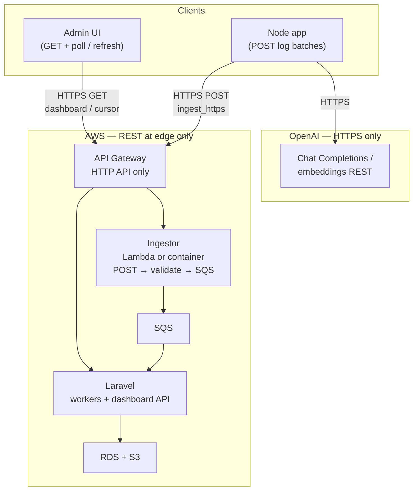
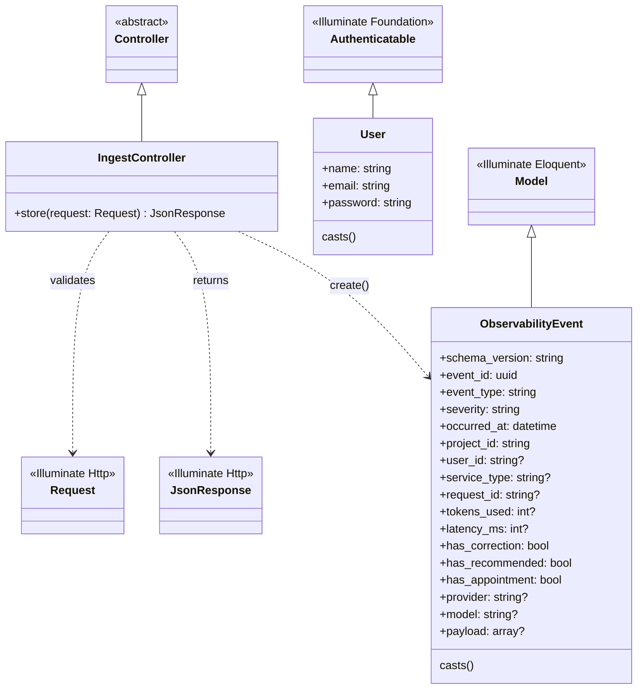

# Laravel application — class diagram

This document describes the **current** `App\` layer and how it sits in the broader ingest architecture. The flowchart matches the HTTPS-only option from the project README; the class diagram reflects code under [`app/`](../app/) today.

## System context (flowchart)

Clients and AWS-shaped components (your design target). Laravel today runs the **ingest + persistence** role directly; later an external **Ingestor** can enqueue to SQS before workers hit Laravel.

## Laravel `App` class diagram (current codebase)

Relationships: **`IngestController`** validates HTTP input and persists **`ObservabilityEvent`** rows. **`User`** is the default Laravel auth model (sessions / future admin UI); it is not yet linked to observability events.

## Future classes (planned, not implemented)

When you add projects, API keys, and a dashboard API, expect something like:

- **`Project`** — `hasMany` **`ObservabilityEvent`**, **`ApiToken`**
- **`ApiToken`** — authenticates ingest requests (middleware)
- **`DashboardController`** or **`EventController`** — `index` / cursor reads for admin UI
- **`ProcessIngestJob`** — if ingest moves to SQS: worker receives payload and creates **`ObservabilityEvent`**

You can extend this file’s Mermaid block as those classes land.
